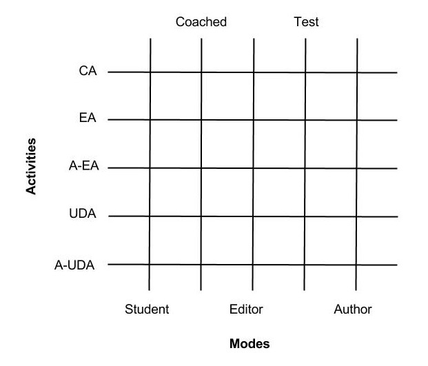

# Activities #

Activities are various ways of interacting with a Dragoon model for various pedagogical goals.  In the past, model construction has been the primary method of instruction, with model exploration being done secondarily, using the sliders in the graph window.  Activities will allow a single authored model to be used in multiple ways, chosen at the start of the activity.

Activities are orthogonal to [feedback modes](major-modes.md).  The differences and interactions between Activities and Modes is documented in the architecture section [below](activities.md#relationship-between-activities-and-modes).

## Overview of the Activities
Dragoon will support the following activities:
* Construction Activity
* Execution Activity
* Automated Execution Activity
* Up and Down Activity
* Automated Up and Down Activity

### Construction Activity
The construction activity is identical to traditional Dragoon problems.  Construction activities can be done in author mode, or any of the student modes.

### Execution Activity
In the execution activity, the student is given the model and executes its calculations by hand.  This is similar to (and ideally, would replace) the task of filling in tables in the introductory workbooks.  The student will fill in the values for the functions and accumulators, then the model will advance to the next timestep and the student will fill them in again.  This repeats until the student has completed the desired number of timesteps (suggested number is two); then the graph/table window is shown for the rest.  Depending on the feedback mode, the student may be required to fill out the nodes in a particular order.

#### Pedagogical Goals
* To learn how the values of quantities are propogated through models
* To observe closely how the values of a particular model are calculated (?)

#### Workflow
All nodes which the author marked as "in model" and "optional" (?) will appear on the canvas.  The appearance of a node will depend on its type:
* Parameters 
  * All fields are filled in corretly by the system at the start; the student will never need to modify parameters
  * Solid green border
  * Interior of the node shows the value and units (in all cases in this document, units appear only when entered by author)
  * Clicking on the node opens the node editor with all fields disabled (uneditable)
* Functions and Accumulators
  * Nodes begin with dashed borders 
  * For functions: the interior of the node shows a blank where the value should be, with the units filled in beneath.
  * For accumulators: the interior of the node has four lines:
    * The initial value
    * A downward pointing arrow
    * The new value for this timestep (i.e. the initial value + value of expression); initially blank
    * The units
  * Clicking on the node opens the node editor with all fields disabled and filled in with author's values except for a new field called "current value" which the student must fill in.
  * The expression field is always given, however it will be hidden initially and may be revealed by clicking on it.
  * After the current value is filled in:
    * The node border becomes solid, and depending on the feedback mode may become colored as well.
    * Arrows leaving that node will be highlighted (depending on the feedback mode ?)

When all nodes have been given the correct values, a completion message window appears.  
* "You have computed all of the values for `<time>` of `<total time student is required to execute>`.  Click ok to advance to the next timestep."
* On advancing, the values are cleared from the functions and accumulators and they return to having grey dashed borders.  The initial values in the accumulators are replaced with the value the student computed in the previous timestep.
* When the final desired timestep has been completed, the message becomes "You have computed all of the required values for time `<time>`.  Now Dragoon will do the rest for you.  Click 'Graph' to see the results."

The start and end time will be given to the system at the start of the problem, so the instructor may decide how many iterations the student will work through, rather than the author.
  
#### Feedback Modes

### Automated Execution Activity
This activity is similar to the aforementioned Execution Activity, but instead of opening the node editor and entering the value for each node, the student simply clicks on the node and Dragoon displays the expression and fills in the value for the student.  It is intended primarily for demonstration purposes.
#### Pedagogical Goals
* To demonstrate how Dragoon computes values at each timestep
#### Workflow
#### Feedback Modes

### Up and Down Activity
#### Pedagogical Goals
#### Workflow
#### Feedback Modes

### Automated Up and Down Activity
#### Pedagogical Goals
#### Workflow
#### Feedback Modes

## Architecture
This section gives an outline of the coding method we will follow to implement activities. Most important thing to understand here is to understand how modes and activities are related. 

### Relationship between activities and modes
To visualize this we can imagine activities and modes to laid out on grid like structure. See the image:

Now, Dragoon can be used in n X m ways where `n` is number of activities and `m` are number of modes. To add another new activity we will add just another line in the grid in that direction. Thus code changes have to be in a similar manner as well. There are a few modes which wont be available in all the activities and we will stop that from happening using `activities-parameters.js`.  

Now lets see the proper changes that we need to make to specific parts of dragoon. The basic coding methodology will be to make Dragoon activities and modes modular. The parameters given for activity and mode will define how the Dragoon interface will change. One important thing here is we want to make minimal changes to the model (in part for backwards-compatibility).  That is, ideally we will be able to open any existing models for use with the new activities.  For certain activities we might need to copy the given nodes to student nodes with appropriate changes at load time.

* Changes to model - The exact new parameters that we need to add for each activity will be updated in [Model JSON file](json-format.md). For all the new parameters we will need getter and setters as well as model related changes in both Author and Student mode as per the requirement.
* Changes to controller - To give Dragoon modularised approach we will need to make a lot of code changes in the controller. Each field should be updated to be handled with a parameter. If that parameter is switched off then that field will not be visible in Node editor. These parameters will come from ui-parameters.js. 
* Changes to PM - PM holds the most important data structure for feedback. It is connected to each mode. Now we will need to extend it to two dimensional data structure. Where when student wrote a wrong answer in a construction activity, the values were picked from mode and the corresponding error status of the student. Now it will be picked up from activity, mode and then the error status. So basically the table will be three dimensional (3D) now. After updating the table we will need to make sure the previous code changes are made and tested properly. Then we will start adding the other activity feedbacks and corresponding field changes for it.
* New ui-parameters - This will tell us for a particular activity and mode, what are we supposed to show. This will be purely UI changes, i.e. what to show in Menu bar and what to show in Node editor and other UI changes. 
* New activity-parameters - This will tell us for each activity and corresponding mode, what are the functionalities that will be used. Like for Test mode we dont want feedback. So this will come from this file. This will exhaustively define what kind of behavior will each activity have.

