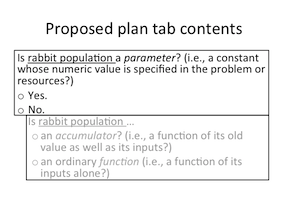
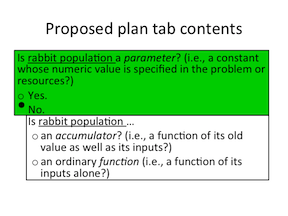
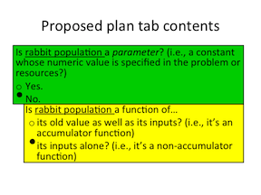
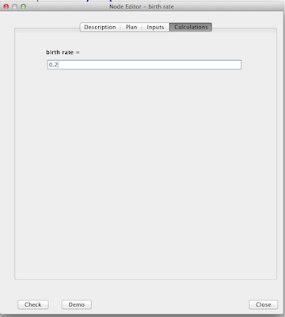
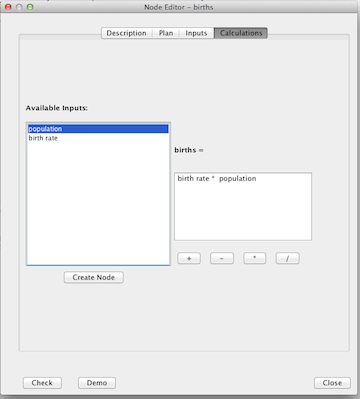
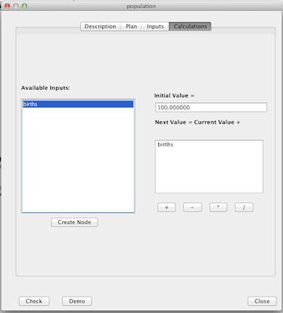

# Node Editor #

The node editor window has several tabs.

Proposed java [class structure for the node editor tabs](Draft_Design_of_Node_Editor.docx) 
by Ram.

## Description tab ##

## Plan tab ##

The plan tab consists of a three way choice between "function," "accumulator," and "parameter".
In the code, these should be represented as variables in case we need
to change terminology.

First, the design for the August 21 2013 release is described, then possible 
improvements/extensions are discussed. The intent of the Aug. 21 design
is to deviate as little as possible from the existing design.  The tab would
let the student choose from the following 3:
> The `<quantity>` is a ...  
> * Parameter (a constant whose value is specified in the problem)  
> * Accumulator (a quantity whose new value depends on its old value and its inputs)  
> * Function (a quantity that depends on its inputs alone)   

where `<quantity>` is the name of the quantity.

If the student chooses correctly on the first try, then it turns green.
Otherwise it can only turn red or yellow, depending on the student choice.

### Possible improvements to the Plan tab ###

#### Two-step process ####
Kurt suggests doing a process of 2 binary choices for the plan tab.
Since these are both true-false selections, there is no need for
the `Check` or `Demo` buttons: immediate feedback can be given to the 
student at each step.  Thus, ending colors would be either green or 
yellow for parameters, and a combination of green and yellow 
for functions and accumulators.  It would look like this:  

  

#### Subchoices ####
Allow for further classification of a quantity based on the
`<Plan>` field of the problem xml file.  This would still have the three 
types as a top-level categorization.  For instance, one could have
the following sub-choices:
> * Parameter
* Function
* Accumulator
    + Diverges (goes to infinity)
    + Converges (goes to zero)
    + Oscillates

This change probably should wait until an instructor requests it.

## Calculation tab ##

First, I describe the August 21, 2013 release design, and then list
possible later improvements/extensions.  The intent of the Aug. 21 design
is to deviate as little as possible from the existing design.  The Aug. 21 
design will continue using the Netbeans default layout manager, rather than 
[a more modern layout manager](https://trello.com/c/IUjqQa5f/100-layout-with-swing-sucks), 
so there is no point in improving the layout.

     

* The Calculations tab selector (at the top of the page) is grayed out
until the node type is selected in the plan tab.

* For *functions* and *accumulators*, the box on the left ("inputs box") will be populated 
with all currently defined nodes.

* If a user clicks on a quantity in the inputs box, it will be added to the 
equation box at the position of the equation box cursor.

* A student may also type text directly into the equation box.

* After any modification to the text in the equation box, it will be scanned for the 
presence of any quantity names, normalizing capitalization and whitespace, making an 
"equation quantities" list.  Any quantity names in the inputs box that are found 
in the equation quantities list are shown in **boldface**.  Note that we want to 
boldface quantities even if the parsing fails.

* For accumulators, we currently have:

    > New value = old value +

    Which does not instantiate the variable name and is confusing when the expression
in the equation box starts with a `-`.  We will use the following:

    > Change in `<quantity>` per `<unit time>` =

    where `<quantity>` is the name of the quantity and `<unit time>` is `seconds`,
`hours`, *et cetera*, depending on the time unit chosen for this problem.

### Possible Improvements to the Calculation tab ###

#### Special Functions ####
Allow the use of special functions in the equation box (powers, logs, *et cetera*). 
Rather than creating an extensive palette, I would suggest adding a button under 
the equation box that gives either a pop-up help menu (showing what to type) or a palette.

Brian Eno requested the special functions.

#### Error handling for numerical values ####
When a student enters an equation which outputs the correct numerical value
(for test values of the inputs) but the equation quantities list (see above) is still 
missing parameters, then one can assume that the 
student has substuted in a numerical value for that parameter.
(Alternatively, one can search the equation parse tree for numerical values that
correspond to problem parameters.)  If this happens, the student should be given 
a special hint.  If the parameter has been defined:  
> You used `<number>` for `<quantity>`, it is better to explicitly use `<quantity>` 
> in your equation.

Otherwise 
>You used `<number>` in your equation instead of a quantity.  
>Press the `<create node>` button to create a node for this quantity.

This latter hint is way too long.

#### Alternative text for the equation box for accumulators  ####
Another format proposed at the UCLA visit is:

>  New `<quantity>` = old `<quantity>`   
>  +

with the `+` appearing as the first character in the equation box.
This form has the advantage that it matches the introductory materials better.
However, units are inconsistant and this form would require special 
diagnosis/handlers for cases the student erases the plus (incorrect) or changes it 
into a minus (may be correct or incorrect).
